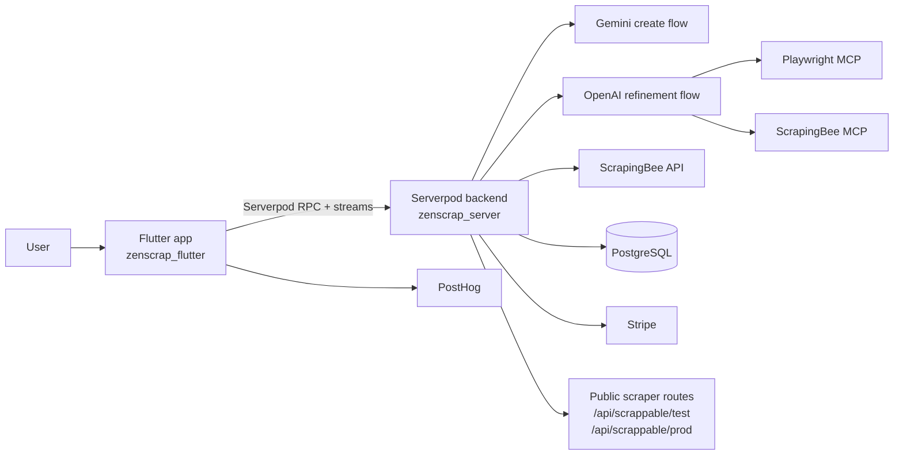
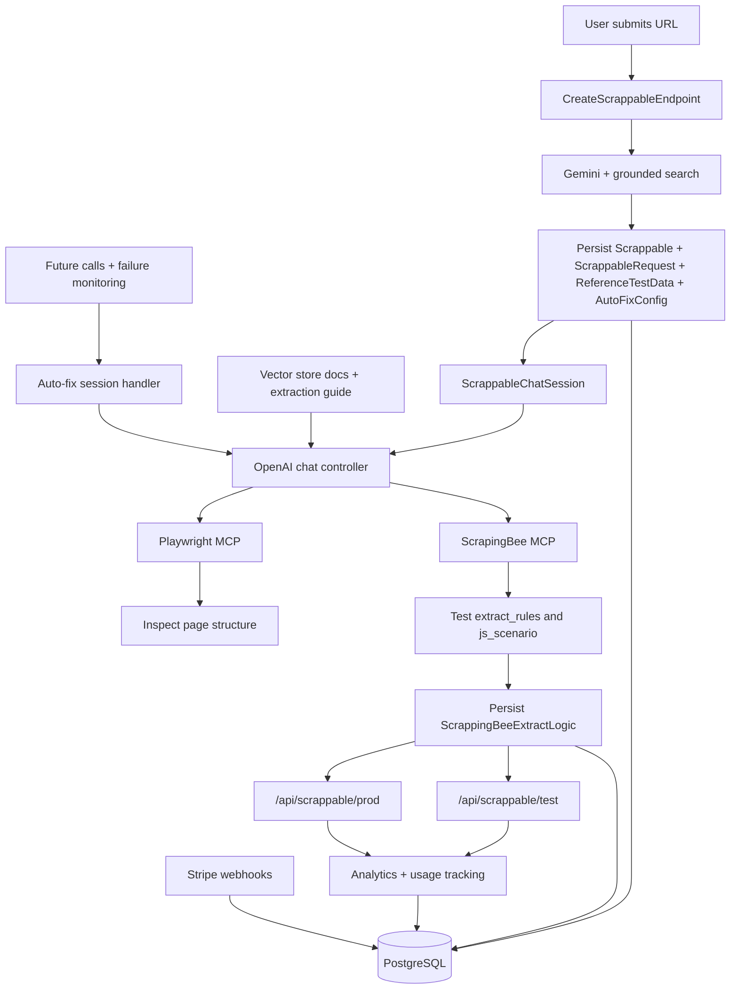
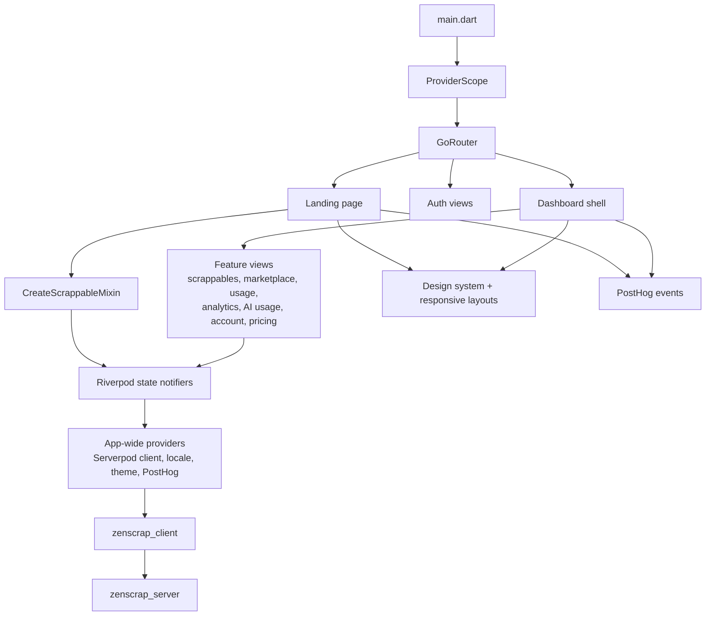

<p align="center">
  
</p>

<h1 align="center">ZenScrap</h1>

<p align="center">
  <strong>Self-healing AI-assisted web scraping infrastructure built with Dart.</strong>
</p>

<p align="center">
  Public codebase of the original ZenScrap SaaS.
</p>

<p align="center">
  ZenScrap turns a target URL and a plain-language request into a tested ScrapingBee-backed scraper,
  a reusable API contract, and a self-healing runtime that can detect breakage, repair extraction rules,
  and bring a scraper back online automatically.
</p>

<p align="center">
  <a href="https://www.zenscrap.com/">Website</a>
  |
  <a href="#what-is-zenscrap">What Is ZenScrap?</a>
  |
  <a href="#architecture-at-a-glance">Architecture</a>
  |
  <a href="#server-architecture">Server</a>
  |
  <a href="#flutter-architecture">Flutter</a>
</p>

<p align="center">
  
  
  
  
  
  
</p>

## Table of Contents

- [What Is ZenScrap?](#what-is-zenscrap)
- [Why self-healing matters](#why-self-healing-matters)
- [Repository Map](#repository-map)
- [Core Stack](#core-stack)
- [How a scraper is created, monitored, and self-healed](#how-a-scraper-is-created-monitored-and-self-healed)
- [AI prompt architecture](#ai-prompt-architecture)
- [Architecture at a glance](#architecture-at-a-glance)
- [Server architecture](#server-architecture)
- [Flutter architecture](#flutter-architecture)
- [Running locally](#running-locally)

## What Is ZenScrap?

ZenScrap started as a SaaS for people who needed production-ready web scrapers without manually writing CSS selectors, browser automation flows, proxy strategies, or anti-bot workarounds. This repository is the public version of that product codebase.

The product experience is intentionally simple:

1. Paste a target URL.
2. Describe, in natural language, what data should be extracted.
3. Let the platform generate a request contract, build and test ScrapingBee extraction rules, expose a callable API, and keep monitoring the scraper over time.

What makes ZenScrap different from most scraper builders is that it is designed around the full lifecycle, not only the first successful run. The product thesis is that a scraper is not finished when it first works. The hard part starts later, when the target site's HTML changes, selectors drift, or interaction steps stop matching the page. ZenScrap treats that as a first-class product problem and includes an automated repair loop for it.

Under the hood, ZenScrap is not a single prompt wrapped in a UI. It is a multi-service system built in Dart:

- A **Serverpod backend** orchestrates AI generation, chat-based refinement, persistence, billing, analytics, and public scraper execution routes.
- A **Flutter client** provides the landing page, authenticated dashboard, chat workflow, analytics screens, and marketplace UI.
- **AI orchestration** is split between an initial URL analysis flow and a deeper repair/refinement flow with tool access.
- A **self-healing loop** watches for repeated failures, triggers an automated fix flow, re-tests the scraper, and restores service with minimal downtime.
- **ScrapingBee** is the execution layer used to test and run extract rules.
- **PostHog** is used for product analytics.

The live SaaS is available at [zenscrap.com](https://www.zenscrap.com/).

> In the codebase, the central domain object is a **Scrappable**: a persisted scraper definition that combines a request template, reference data, extraction logic, analytics, and auto-fix settings.

## Why self-healing matters

Most scraping tools help you generate a scraper once. ZenScrap was built to solve the next problem too: **what happens when the target page changes after the scraper is already in production**.

If the HTML changes, the usual outcome in this industry is straightforward:

1. selectors stop matching
2. the scraper starts failing
3. someone has to notice
4. someone has to debug the DOM manually
5. the endpoint stays offline until the rule set is repaired

ZenScrap's strongest differentiator is that it shortens that failure window. When a saved scraper starts failing repeatedly, the backend can trigger an auto-fix flow that:

1. detects the breakage from request analytics and failure history
2. revisits the page with Playwright tooling
3. regenerates the broken ScrapingBee logic against the current DOM
4. validates the fix before saving it back
5. brings the scraper back online without requiring a human to rebuild it from scratch

The value to the user is practical: instead of a scraper staying broken until someone manually intervenes, the platform is built to keep downtime short and recover quickly. That is why the landing page leads with **"Web Scrapers That Fix Themselves"** and why the self-healing system is not just a feature add-on, but a core architectural decision in this repository.

## Repository Map

ZenScrap is organized as a multi-package Dart workspace:

| Package | Role |
| --- | --- |
| `zenscrap_server` | Serverpod backend: auth, AI orchestration, persistence, billing, analytics, public API routes, auto-fix jobs, and web hosting |
| `zenscrap_flutter` | Flutter client: landing page, auth flows, dashboard, chat UI, analytics views, pricing, and marketplace |
| `zenscrap_client` | Generated Serverpod client consumed by Flutter for typed RPC and streaming |
| `zenscrap_core` | Shared Dart utilities used on both sides, such as banned-domain validation and ScrapingBee country-code helpers |
| `scrapping_bee_mcp` | MCP server used to validate ScrapingBee extract rules against real pages |
| `playwright-mcp-railway` | Playwright-based MCP service used for browser automation and DOM inspection during AI sessions |

Both the backend and the client are written in **Dart**. The backend is built on **Serverpod** and the frontend is built with **Flutter**.

## Core Stack

These are the main architectural technologies and services that shape the project:

| Technology | Where it is used | Why it matters here |
| --- | --- | --- |
| **Dart** | Entire repo | Shared language across backend, frontend, generated client, and shared utilities |
| **Serverpod** | `zenscrap_server`, `zenscrap_client` | RPC layer, streaming endpoints, auth integration, persistence, routes, and future calls |
| **Flutter** | `zenscrap_flutter` | Single codebase for the product UI, especially the web SaaS dashboard |
| **Riverpod** | `zenscrap_flutter` | Feature state management via Notifier-based state objects and app-wide providers |
| **go_router** | `zenscrap_flutter` | Declarative routing and auth-aware redirects |
| **PostHog** | `zenscrap_flutter` | Product analytics, screen tracking, session replay, and behavior instrumentation |
| **ScrapingBee** | `zenscrap_server`, MCP tooling | The actual extraction engine used to test and execute scraper logic |
| **OpenAI Responses API** | `zenscrap_server` chat flows | Tool-using chat system for iterative scraper refinement, schema-validated outputs, and auto-fix flows |
| **Gemini** | `zenscrap_server` create flow | Initial URL analysis and structured request-template generation with search grounding |
| **Stripe** | `zenscrap_server` | Subscription management, credit purchases, and webhook-driven billing updates |
| **Dio / http** | server and client | HTTP clients for ScrapingBee, Stripe, OpenAI, Gemini, and other integrations |
| **Freezed / json_serializable** | server and client | Immutable state modeling and serialization support |
| **result_dart** | server and client | Explicit success/failure handling in API interactions |
| **Talker** | `zenscrap_flutter` | Logging and error visibility during UI development |
| **seo** | `zenscrap_flutter` | Search-engine-friendly metadata for the web build |

## How a scraper is created, monitored, and self-healed

The runtime workflow is split into two AI stages plus an operations loop:

1. **Initial generation**: the server analyzes a reference URL and produces a `ScrappableRequest` shape, including path parameters, query parameters, language metadata, and a category.
2. **Interactive refinement**: a chat session uses OpenAI plus MCP tools to inspect the page, write ScrapingBee `extract_rules`, test them, optimize cost, and persist the working configuration.
3. **Execution**: the public API routes run the saved extractor against user payloads and return structured JSON.
4. **Observation**: analytics, usage counters, and request histories are stored for both product reporting and failure diagnosis.
5. **Breakage detection**: when the target site's HTML changes and selectors stop matching, repeated failures accumulate instead of disappearing into logs.
6. **Self-healing**: background jobs can trigger an automatic repair flow that revisits the page, updates selectors or interaction steps, re-tests the configuration, and restores the scraper.

This repair path is a major product differentiator. ZenScrap is not only trying to generate a scraper faster; it is trying to reduce the amount of time a production scraper stays broken after a site change.

## AI Prompt Architecture

ZenScrap relies on several prompt surfaces, not just one model call. Reading these files is the fastest way to understand the product logic:

| File / prompt surface | Purpose |
| --- | --- |
| `zenscrap_server/lib/src/endpoints/public/create_scrappable.dart` | Builds the initial prompt used by Gemini to transform a raw reference URL into a named, localized, categorized `ScrappableRequest` |
| `zenscrap_server/lib/src/endpoints/public/chat_controller/openai_prompt_builder.dart` | Main OpenAI system prompt for iterative editing, testing, cost optimization, strict JSON output, and request-shape repair |
| `zenscrap_server/lib/src/core/auto_fix/auto_fix_prompt_builder.dart` | Specialized self-healing prompt for repairing broken extractors after repeated failures |
| `zenscrap_server/lib/src/core/scrapping_bee_extract_rule_context.dart` | Large inline extraction manual that teaches the model how to use ScrapingBee formats, nested rules, tables, JS scenarios, and selector limitations |
| Vector-store docs initialized in `chat_controller_openai_sdk_impl.dart` | Searchable documentation for cost optimization, request editing, and request structure |

This split matters because ZenScrap is solving different problems at different moments:

- **Gemini** is used to infer the initial API contract from a URL.
- **OpenAI** is used for tool-based exploration, iterative refinement, and auto-fix.
- **Prompt context** includes request-shape rules, ScrapingBee syntax, cost strategy, and the current state of the scrappable being edited.

## Architecture at a glance



## Server Architecture

### What the server is responsible for

`zenscrap_server` is the operational core of the product. It is responsible for:

- authenticating users with Google and email/password flows
- generating the first version of a scrappable from a raw URL
- running the chat-based refinement loop with OpenAI and MCP tools
- persisting scrappables, request contracts, reference data, analytics, and billing state
- exposing public scraper execution routes for test and production use
- scheduling background jobs for cleanup, analytics aggregation, and auto-fix
- detecting repeated scraper failures and triggering a repair loop
- receiving Stripe webhooks and keeping account state in sync
- serving the Flutter web build and legal/static pages from the same backend

### Core server concepts

| Entity | Purpose |
| --- | --- |
| `Scrappable` | Top-level scraper record with ownership, naming, category, lifecycle timestamps, and references to request, rules, analytics, and auto-fix config |
| `ScrappableRequest` | Request contract: URL template, path params, query params, and client-side placeholders used by `js_scenario` or extract rules |
| `ScrappingBeeExtractLogic` | Persisted ScrapingBee settings such as `extractRules`, `jsScenario`, `renderJs`, proxy selection, waits, country, and Google handling |
| `ReferenceTestData` | Example page context and stored test artifacts used during refinement |
| `AutoFixConfig` | Self-healing settings such as thresholds, in-progress state, retry counters, and AI model preference |
| `ScrappableAnalytics` | Historical request-level usage and status data used for dashboards and troubleshooting |

### Server folder structure

```text
zenscrap_server/
├── bin/
│   └── main.dart
├── config/
│   ├── development.yaml
│   ├── production.yaml
│   ├── staging.yaml
│   └── test.yaml
├── lib/
│   ├── server.dart
│   └── src/
│       ├── auth/                  # email + Google auth helpers and mail hooks
│       ├── core/
│       │   ├── auto_fix/          # self-healing orchestration
│       │   ├── docs/              # prompt-side reference docs
│       │   ├── ip_validation/     # anonymous-user abuse protection
│       │   ├── stripe/            # billing integration
│       │   └── translations/      # localized error messages
│       ├── endpoints/
│       │   ├── auth/              # auth/profile endpoints
│       │   ├── private/           # logged-in dashboard/account endpoints
│       │   └── public/
│       │       ├── chat_controller/
│       │       │   ├── chat_controller_openai_sdk_impl.dart
│       │       │   ├── chat_controller_handler_mixin.dart
│       │       │   ├── openai_prompt_builder.dart
│       │       │   └── web_scraper_ai_models.dart
│       │       ├── create_scrappable.dart
│       │       ├── marketplace_endpoint.dart
│       │       └── scrappable_chat_session.dart
│       ├── entities/              # Serverpod models
│       ├── future_calls/          # scheduled jobs
│       ├── notifications/         # email notifications
│       ├── routes/                # public scraper HTTP routes
│       ├── web/                   # terms, privacy, success page, SPA hosting
│       └── webhooks/              # Stripe webhook handling
├── migrations/
├── test/
└── web/
```

### Server runtime breakdown



### Important server implementation notes

- `server.dart` is more than a bootstrap file. It wires authentication, web routes, static hosting, Stripe webhooks, ScrapingBee configuration, OpenAI vector-store initialization, and recurring future calls.
- The Flutter web app is served by the Serverpod backend through `SpaRoute`, so the server acts as both API host and web host.
- The chat editing flow is session-based. `scrappable_chat_session.dart` keeps in-memory caches for live editing, thinking streams, and delayed commit behavior.
- The OpenAI refinement flow is schema-driven. `openai_prompt_builder.dart` and `web_scraper_ai_models.dart` enforce structured outputs rather than free-form assistant text.
- The public execution path is intentionally separated into `/api/scrappable/test` and `/api/scrappable/prod`, handled by `scrappable_api_route.dart`.
- Auto-fix is the clearest product differentiator in the codebase. It is implemented as a real background capability through `FutureCall` jobs, failure tracking, a dedicated prompt builder, and the same MCP-backed repair tooling used in the manual editing flow.

## Flutter Architecture

### What the Flutter app is responsible for

`zenscrap_flutter` is the product-facing application. It handles:

- the public landing page and first-time scraper creation flow
- authentication screens and session-aware navigation
- the chat experience for editing extract rules
- dashboard modules for user scrappables, marketplace, API usage, AI usage, analytics, pricing, and account settings
- design system primitives, responsive layouts, and localization
- client-side analytics via PostHog

### Flutter folder structure

```text
zenscrap_flutter/
├── assets/
├── lib/
│   ├── l10n/                      # generated and source localization files
│   ├── main.dart
│   └── src/
│       ├── core/
│       │   ├── extensions/
│       │   ├── mixins/
│       │   ├── theme/
│       │   ├── utils/
│       │   └── web/
│       ├── design_system/
│       │   ├── components/
│       │   ├── elements/
│       │   ├── layouts/
│       │   ├── responsive/
│       │   └── widgets/
│       ├── providers/             # app-wide services and integrations
│       ├── repositories/
│       ├── states/                # Riverpod feature state modules
│       │   ├── account/
│       │   ├── ai_usage/
│       │   ├── analytics/
│       │   ├── api_usage/
│       │   ├── chat_session/
│       │   ├── dashboard/
│       │   ├── marketplace/
│       │   ├── scrappables/
│       │   ├── session/
│       │   ├── theme/
│       │   └── translation/
│       └── ui/
│           ├── account/
│           ├── ai_usage/
│           ├── api_analytics/
│           ├── api_usage/
│           ├── auth/
│           ├── dashboard/
│           ├── landing_page/
│           ├── legal/
│           ├── marketplace/
│           ├── pricing_page/
│           ├── scrap_session/
│           └── scrappables/
├── test/
│   ├── states/
│   └── ui/
├── tool/
│   └── check_structure.dart
└── web/
```

### Flutter runtime breakdown



### Important Flutter implementation notes

- `main.dart` initializes PostHog, configures the Serverpod client, sets web URL strategy, and boots the app inside a `ProviderScope`.
- Routing is centralized in `go_router_providers.dart`. The router rebuilds based on session state and redirects between splash, landing, auth, and dashboard routes.
- The app uses **Riverpod 3 Notifier-based state**, not ad-hoc mutable state spread across the widget tree.
- The codebase is intentionally split between `providers/`, `states/`, and `ui/`:
  - `providers/` contains app-wide service wiring
  - `states/` contains feature state machines and asynchronous behavior
  - `ui/` contains screens and compositional widgets
- There is a dedicated **design system** and **responsive layout** layer, which is why the app has so many reusable layout and component primitives.
- PostHog is deeply integrated for product instrumentation, not just a page-view snippet.
- `tool/check_structure.dart` enforces UI file conventions such as one public widget per file, suffix rules for pages/views/dialogs/sections, and test structure mirroring.

## Running locally

The project is easiest to understand if you run the backend and Flutter app side by side.

### 1. Start the server

```bash
cd zenscrap_server
dart pub get
serverpod generate --experimental-features=all
docker compose up --build --detach
dart bin/main.dart
```

You will need valid configuration values in `zenscrap_server/config/passwords.yaml` for services such as:

- OpenAI
- Gemini
- ScrapingBee
- Stripe
- Google auth
- email auth secrets

### 2. Start the Flutter app

```bash
cd zenscrap_flutter
flutter pub get
flutter run -d chrome
```

By default, the Flutter app points to `http://localhost:8080/` in debug mode. In production builds it uses `https://api.zenscrap.com/`, and you can override the backend with:

```bash
flutter run --dart-define=SERVER_URL=https://your-server-url/
```

### 3. Useful dev commands

```bash
# Flutter
cd zenscrap_flutter
flutter analyze --fatal-infos
flutter test
dart run tool/check_structure.dart
dart run build_runner build --delete-conflicting-outputs

# Server
cd zenscrap_server
dart test
serverpod create-migration --experimental-features=all
serverpod migrate --experimental-features=all
```

---

ZenScrap is now public as an open codebase for an AI-first, self-healing scraping product that combines Dart on both sides of the stack, Serverpod on the backend, Flutter on the frontend, and ScrapingBee-backed extraction workflows under a chat-driven UX.
