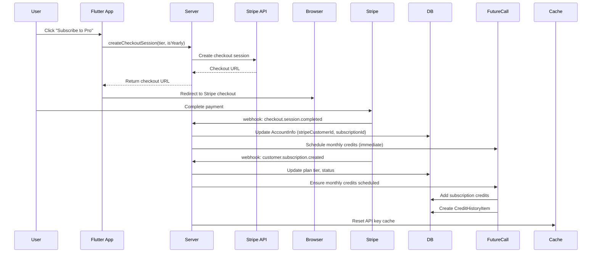
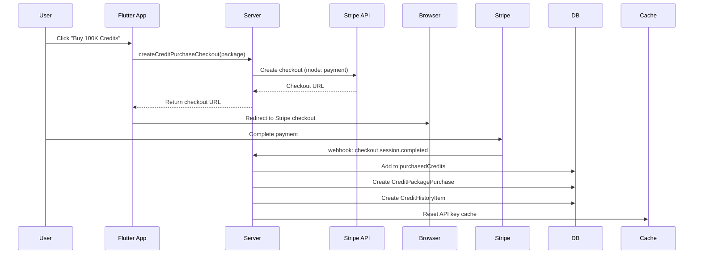
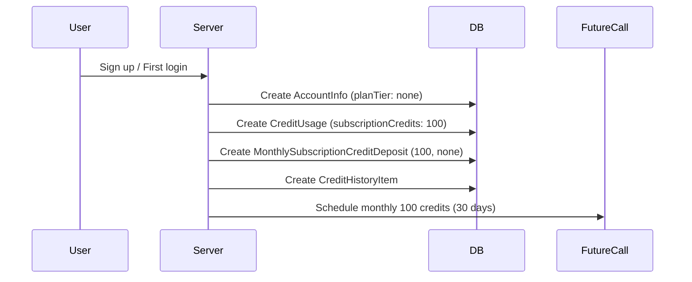
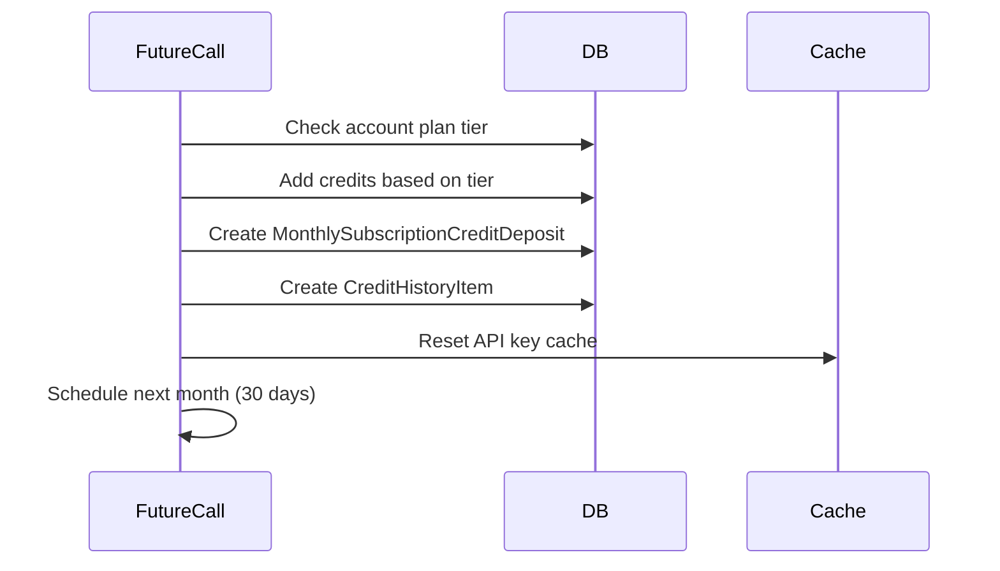

# Stripe Integration - Complete Guide

## Table of Contents
1. [Overview](#overview)
2. [Products & Pricing](#products--pricing)
3. [Setup & Configuration](#setup--configuration)
4. [Database Schema](#database-schema)
5. [Payment Flows](#payment-flows)
6. [Webhook Events](#webhook-events)
7. [Testing](#testing)
8. [Updating Products](#updating-products)
9. [Troubleshooting](#troubleshooting)

---

## Overview

ZenScrap uses Stripe for two types of payments:
1. **Recurring Subscriptions** - Monthly/yearly plans (Basic, Pro, Ultra)
2. **One-Time Purchases** - Credit packages (Small, Medium, Large)

### Key Features
- Pre-filled email checkout sessions
- Automatic plan tier updates via webhooks
- API credit management based on subscription
- Secure webhook signature verification
- Transaction-safe credit operations

---

## Products & Pricing

### Subscription Plans

| Plan | Monthly Price | Yearly Price | Credits/Month |
|------|--------------|--------------|---------------|
| **Free Tier** | Free | Free | 100 credits |
| **Basic** | $100/month | $1,050/year | 250,000 credits |
| **Pro** | $199/month | $1,999/year | 1,000,000 credits |
| **Ultra** | $500/month | $5,500/year | 4,000,000 credits |

### Credit Packages (One-Time Purchase)

| Package | Credits | Price |
|---------|---------|-------|
| **Small** | 100,000 | $59 |
| **Medium** | 1,000,000 | $199 |
| **Large** | 2,500,000 | $399 |

### Test Mode Products

#### BASIC Plan
- **Product ID**: `prod_SzT1JodyIIh9Mh`
- **Monthly Price**: `price_1S3U5wJRaWX4CIXenvcTnLbC`
- **Yearly Price**: `price_1S3U6AJRaWX4CIXeN4aKDnvN`

#### PRO Plan
- **Product ID**: `prod_SzT1qTKRmLZcUW`
- **Monthly Price**: `price_1S3U6CJRaWX4CIXeeCaEeULW`
- **Yearly Price**: `price_1S3U6EJRaWX4CIXekaSGkvTu`

#### ULTRA Plan
- **Product ID**: `prod_SzT1ytDYhYeUKt`
- **Monthly Price**: `price_1S3U6FJRaWX4CIXezhqs1dCQ`
- **Yearly Price**: `price_1S3U6HJRaWX4CIXeMMH3G54R`

### Production Mode Products

#### BASIC Plan
- Monthly: `price_1S3Sy0JRaWX4CIXeuQOpqBXd`
- Yearly: `price_1S3Sy0JRaWX4CIXeVnjyyFEt`

#### PRO Plan
- Monthly: `price_1S3Sy1JRaWX4CIXeRvGu2GUf`
- Yearly: `price_1S3Sy1JRaWX4CIXeC5MQdHGr`

#### ULTRA Plan
- Monthly: `price_1S3Sy2JRaWX4CIXeunmShcxL`
- Yearly: `price_1S3Sy2JRaWX4CIXe3mJk8AOl`

---

## Setup & Configuration

### 1. Stripe Dashboard Configuration

#### Create Products and Prices
1. Go to [Stripe Dashboard → Products](https://dashboard.stripe.com/products)
2. Create subscription products (Basic, Pro, Ultra)
3. For each subscription, create monthly and yearly prices
4. Create one-time purchase products for credit packages
5. Note all Price IDs (format: `price_xxxxxxxxxxxxx`)

#### Configure Webhook Endpoint
1. Go to [Stripe Dashboard → Webhooks](https://dashboard.stripe.com/webhooks)
2. Add endpoint: `https://yourdomain.com/stripe/webhook`
3. Select events:
   - `checkout.session.completed`
   - `customer.subscription.created`
   - `customer.subscription.updated`
   - `customer.subscription.deleted`
   - `invoice.payment_succeeded`
   - `invoice.payment_failed`
4. Copy webhook signing secret (starts with `whsec_`)

### 2. Server Configuration

#### Update passwords.yaml

```yaml
development:
  # Stripe Keys
  stripe_secret_key: 'sk_test_YOUR_KEY'
  stripe_webhook_secret: 'whsec_YOUR_SECRET'

  # Subscription Price IDs
  stripe_basic_price_id_monthly: 'price_1S3U5wJRaWX4CIXenvcTnLbC'
  stripe_basic_price_id_yearly: 'price_1S3U6AJRaWX4CIXeN4aKDnvN'
  stripe_pro_price_id_monthly: 'price_1S3U6CJRaWX4CIXeeCaEeULW'
  stripe_pro_price_id_yearly: 'price_1S3U6EJRaWX4CIXekaSGkvTu'
  stripe_ultra_price_id_monthly: 'price_1S3U6FJRaWX4CIXezhqs1dCQ'
  stripe_ultra_price_id_yearly: 'price_1S3U6HJRaWX4CIXeMMH3G54R'

  # Credit Package Price IDs
  stripe_credit_package_small_price_id: 'price_YOUR_SMALL_PACKAGE_ID'
  stripe_credit_package_medium_price_id: 'price_YOUR_MEDIUM_PACKAGE_ID'
  stripe_credit_package_large_price_id: 'price_YOUR_LARGE_PACKAGE_ID'

  # Redirect URLs
  stripe_success_url: 'http://localhost:3000/success'
  stripe_cancel_url: 'http://localhost:3000/cancel'
  stripe_portal_return_url: 'http://localhost:3000/account'

production:
  # Same structure with production keys and URLs
  stripe_secret_key: 'sk_live_YOUR_KEY'
  stripe_webhook_secret: 'whsec_YOUR_PRODUCTION_SECRET'
  # ... rest of production config
```

### 3. Database Migration

```bash
cd zenscrap_server
serverpod generate --experimental-features=all
serverpod create-migration --experimental-features=all
serverpod migrate --experimental-features=all
```

---

## Database Schema

### Entity Files (.spy.yaml)

#### 1. `AccountInfo`
**File**: `zenscrap_server/lib/src/entities/account/account_info.spy.yaml`

```yaml
fields:
  planTier: PlanTier  # none, basic, pro, ultra
  stripeCustomerId: String?
  stripeSubscriptionId: String?
  subscriptionStatus: String?  # active, past_due, canceled, trialing
  subscriptionEndDate: DateTime?
  accountApiUsageId: int
```

#### 2. `CreditUsage`
**File**: `zenscrap_server/lib/src/entities/account/api_usage/credit_usage.spy.yaml`

```yaml
fields:
  subscriptionCredits: int  # Credits from subscription/monthly allocation
  purchasedCredits: int     # Credits from one-time purchases
```

#### 3. `CreditHistoryItem`
**File**: `zenscrap_server/lib/src/entities/account/api_usage/api_credit_history/api_creadit_history_item.spy.yaml`

```yaml
fields:
  date: DateTime
  monthlySubscriptionCreditDeposit: MonthlySubscriptionCreditDeposit?, relation(optional)
  creaditPackagePurchase: CreditPackagePurchase?, relation(optional)
  accountApiUsage: AccountApiUsage?, relation(name=api_usage_history)
```

**Note**: There's a typo in the field name `creaditPackagePurchase` (should be `creditPackagePurchase`), but it's consistent throughout the codebase.

#### 4. `MonthlySubscriptionCreditDeposit`
**File**: `zenscrap_server/lib/src/entities/account/api_usage/api_credit_history/monthly_subscription_credit_deposit.spy.yaml`

```yaml
fields:
  creditsAmount: int
  planTier: PlanTier
```

#### 5. `CreditPackagePurchase`
**File**: `zenscrap_server/lib/src/entities/account/api_usage/api_credit_history/credit_package_purchase.spy.yaml`

```yaml
fields:
  value: double
  stripePurchaseId: String?
```

### Database Relationships

```
AccountInfo
├── stripeCustomerId
├── stripeSubscriptionId
├── subscriptionStatus
└── accountApiUsage
    └── creditUsage
        ├── subscriptionCredits
        └── purchasedCredits
    └── creditHistory []
        ├── date
        └── (one of:)
            ├── monthlySubscriptionCreditDeposit
            │   ├── creditsAmount
            │   └── planTier
            └── creaditPackagePurchase
                ├── value
                └── stripePurchaseId
```

---

## Payment Flows

### Flow 1: Subscription Checkout



**Code Location**:
- Endpoint: `zenscrap_server/lib/src/endpoints/private/private_subscription_endpoint.dart`
- Webhook: `zenscrap_server/lib/src/webhooks/stripe_webhook.dart` (lines 63-65, 67-73)
- Future Call: `zenscrap_server/lib/src/future_calls/monthly_subscription_credits_future_call.dart`

### Flow 2: Credit Package Purchase



**Code Location**:
- Endpoint: `zenscrap_server/lib/src/endpoints/private/private_api_usage_endpoint.dart`
- Webhook: `zenscrap_server/lib/src/webhooks/stripe_webhook.dart` (lines 124-129, 191-285)

### Flow 3: New Account Creation (Free Tier)



**Code Location**:
- Endpoint: `zenscrap_server/lib/src/endpoints/private/private_account_endpoint.dart` (lines 55-98)

### Flow 4: Monthly Credit Renewal



**Code Location**:
- Future Call: `zenscrap_server/lib/src/future_calls/monthly_subscription_credits_future_call.dart`

---

## Webhook Events

### Handled Events

#### 1. `checkout.session.completed`
**File**: `stripe_webhook.dart:63-189`

- **For Subscriptions** (metadata: no `purchase_type`):
  - Updates `AccountInfo` with Stripe customer/subscription IDs
  - Sets `subscriptionStatus` to 'active'
  - Schedules immediate credit addition via `monthly_subscription_credits` FutureCall
  - Resets API cache

- **For Credit Packages** (metadata: `purchase_type: 'credit_package'`):
  - Adds credits to `CreditUsage.purchasedCredits`
  - Creates `CreditPackagePurchase` record
  - Creates `CreditHistoryItem` entry
  - Resets API cache

#### 2. `customer.subscription.created`
**File**: `stripe_webhook.dart:287-384`

- Updates `AccountInfo` with subscription details
- Determines `planTier` from price ID
- Sets `subscriptionStatus` and `subscriptionEndDate`
- Schedules immediate credit addition if status is active/trialing
- Resets API cache

#### 3. `customer.subscription.updated`
**File**: `stripe_webhook.dart:386-455`

- Updates `subscriptionStatus` and `subscriptionEndDate`
- Updates `planTier` if price ID changed
- Resets API cache

#### 4. `customer.subscription.deleted`
**File**: `stripe_webhook.dart:457-509`

- Sets `subscriptionStatus` to 'canceled'
- Sets `planTier` to `PlanTier.none`
- Resets API cache

#### 5. `invoice.payment_succeeded`
**File**: `stripe_webhook.dart:511-541`

- Logs successful payment
- Credits are added via scheduled FutureCall system

#### 6. `invoice.payment_failed`
**File**: `stripe_webhook.dart:543-592`

- Sets `subscriptionStatus` to 'past_due'
- Resets API cache

### Webhook Security

**File**: `stripe_api.dart:232-268`

```dart
static bool verifyWebhookSignature({
  required String payload,
  required String signature,
  required String secret,
}) {
  // Extracts timestamp and v1 signature from header
  // Computes HMAC-SHA256 of "timestamp.payload"
  // Compares with received signature
  return expectedSignature == receivedSignature;
}
```

---

## Testing

### Test Mode Setup

1. **Start Local Server**
```bash
cd zenscrap_server
serverpod run --mode development
```

2. **Forward Webhooks Locally**
```bash
stripe listen --forward-to localhost:8080/stripe/webhook
```

3. **Test Cards**
- **Success**: `4242 4242 4242 4242`
- **Decline**: `4000 0000 0000 0002`
- **Requires Authentication**: `4000 0025 0000 3155`

### Testing Subscription Flow

1. Call `createCheckoutSession` endpoint
2. Complete checkout with test card
3. Verify webhooks received:
   - `checkout.session.completed`
   - `customer.subscription.created`
4. Check database:
   - `AccountInfo` has Stripe IDs and correct plan tier
   - `CreditUsage` has credits added
   - `CreditHistoryItem` created

### Testing Credit Package Flow

1. Call `createCreditPurchaseCheckout` endpoint
2. Complete checkout with test card
3. Verify webhook: `checkout.session.completed`
4. Check database:
   - `CreditUsage.purchasedCredits` increased
   - `CreditPackagePurchase` record created
   - `CreditHistoryItem` created

---

## Updating Products

### Why Manual Updates Are Needed

The Stripe MCP server doesn't expose an `update_product` function, only `create_product` and `list_products`. Therefore, product updates must use the Stripe API directly.

### Using the Update Script

**File**: `update_stripe_products.dart`

#### Update Test Mode Products
```bash
dart run update_stripe_products.dart development
```

#### Update Production Products
```bash
dart run update_stripe_products.dart production
```

### What the Script Updates

The script updates product descriptions with current credit amounts:

- **BASIC**: "250,000 API credits per month"
- **PRO**: "1,000,000 API credits per month"
- **ULTRA**: "4,000,000 API credits per month"

### Manual Alternative

Update via [Stripe Dashboard](https://dashboard.stripe.com/products):
1. Navigate to Products
2. Click on each product
3. Update the description field
4. Save changes

---

## Troubleshooting

### Common Issues

#### 1. Webhook Not Receiving Events
**Symptoms**: Payment completes but user account not updated

**Solutions**:
- Verify webhook URL is accessible from internet
- Check webhook secret in `passwords.yaml` matches Stripe Dashboard
- View webhook logs in Stripe Dashboard → Developers → Webhooks
- Check server logs for signature verification errors
- Use Stripe CLI for local testing: `stripe listen --forward-to localhost:8080/stripe/webhook`

#### 2. Checkout Session Not Creating
**Symptoms**: Error when clicking subscribe/purchase button

**Solutions**:
- Verify Stripe API key is correct in `passwords.yaml`
- Check price IDs exist in your Stripe account (test vs production)
- Ensure user is authenticated (all endpoints require login)
- Check server logs for detailed error messages

#### 3. Plan Tier Not Updating
**Symptoms**: User pays but still on free tier

**Solutions**:
- Verify webhook events are being received (check Stripe Dashboard)
- Ensure `account_info_id` is correctly passed in checkout metadata
- Check database transactions completed successfully
- Verify `_getPlanTierFromPriceId()` mapping in `stripe_webhook.dart:594-612`

#### 4. Credits Not Appearing
**Symptoms**: User has subscription but no credits

**Solutions**:
- Check if `monthly_subscription_credits` FutureCall was scheduled
- Verify FutureCall executed successfully (check server logs)
- Ensure `CreditUsage` record exists and linked to `AccountApiUsage`
- Check if API cache was reset (should happen automatically)

#### 5. Credit History Empty
**Symptoms**: User has credits but no history entries

**Solutions**:
- For initial 100 credits: Fixed in `private_account_endpoint.dart` (creates history item)
- For monthly credits: Verify `CreditHistoryItem` created in `monthly_subscription_credits_future_call.dart:88-99`
- For purchases: Verify `CreditHistoryItem` created in `stripe_webhook.dart:262-273`

#### 6. Subscription Status Not Syncing
**Symptoms**: Stripe shows active but app shows inactive

**Solutions**:
- Manually trigger webhook event from Stripe Dashboard
- Use Stripe API to fetch subscription: `retrieveSubscription()`
- Check if webhook handler updated `subscriptionStatus` field
- Verify no database errors during webhook processing

### Debugging Tips

1. **Enable Detailed Logging**
   - Check `session.log()` calls in webhook handlers
   - Set log level to debug mode

2. **Test with Stripe CLI**
   ```bash
   # Trigger specific event
   stripe trigger checkout.session.completed

   # View webhook payloads
   stripe listen --print-json
   ```

3. **Database Inspection**
   ```sql
   -- Check account info
   SELECT * FROM account_info WHERE user_info_id = ?;

   -- Check credit usage
   SELECT * FROM credit_usage WHERE id IN (
     SELECT credit_usage_id FROM account_api_usage WHERE id = ?
   );

   -- Check credit history
   SELECT * FROM credit_history_item WHERE account_api_usage_id = ?;
   ```

4. **Cache Issues**
   - Verify `ApiHelperMixin.resetNanoId()` called after credit changes
   - Check cache maps in `api_helper_mixin.dart`

---

## API Endpoints

### Subscription Endpoints
**File**: `zenscrap_server/lib/src/endpoints/private/private_subscription_endpoint.dart`

#### `createCheckoutSession`
```dart
Future<String> createCheckoutSession(
  Session session, {
  required String tier,      // 'basic', 'pro', or 'ultra'
  required bool isYearly,    // true for yearly, false for monthly
})
```
Returns: Stripe checkout URL

#### `getSubscriptionStatus`
```dart
Future<SubscriptionStatus> getSubscriptionStatus(Session session)
```
Returns: Current subscription details

#### `cancelSubscription`
```dart
Future<void> cancelSubscription(Session session)
```
Cancels active subscription

#### `createCustomerPortalSession`
```dart
Future<String> createCustomerPortalSession(Session session)
```
Returns: URL to Stripe customer portal

### Credit Purchase Endpoints
**File**: `zenscrap_server/lib/src/endpoints/private/private_api_usage_endpoint.dart`

#### `createCreditPurchaseCheckout`
```dart
Future<String> createCreditPurchaseCheckout(
  Session session, {
  required CreditPurchaseOption creditPackage, // small, medium, large
})
```
Returns: Stripe checkout URL

#### `getCreditHistory`
```dart
Future<List<CreditHistoryItem>> getCreditHistory(
  Session session, {
  required int offset,
  required int limit,
})
```
Returns: Paginated credit history

---

## Security Considerations

### 1. Webhook Signature Verification
- All webhooks verified using HMAC-SHA256
- Prevents spoofed webhook requests
- Secret stored in `passwords.yaml` (not in code)

### 2. Pre-filled Email
- Email taken from authenticated user session
- Prevents user manipulation
- Ensures payment linked to correct account

### 3. Account Identification
- Uses `AccountInfo.id` in metadata
- Securely links Stripe customer to internal user
- No PII exposed in Stripe metadata (only IDs)

### 4. Authentication Required
- All endpoints require `requireLogin => true`
- User must be authenticated to create checkout sessions
- Prevents unauthorized purchases

### 5. Transaction Safety
- All database operations use transactions
- Ensures consistency (credits + history created together)
- Rollback on error prevents partial state

### 6. Cache Invalidation
- API cache reset after every credit change
- Prevents stale credit balances
- Ensures users see updated limits immediately

---

## Credit System Summary

### Credit Types

1. **Subscription Credits** (`CreditUsage.subscriptionCredits`)
   - Reset/renewed monthly
   - Amount based on plan tier
   - Used first when making API calls

2. **Purchased Credits** (`CreditUsage.purchasedCredits`)
   - Never expire
   - From one-time credit package purchases
   - Used after subscription credits exhausted

### Credit Deduction Priority
**File**: `api_helper_mixin.dart:228-290`

1. Deduct from subscription credits first
2. If insufficient, deduct remainder from purchased credits
3. Throw `insufficientCredits` error if total insufficient

### Credit History Display
**File**: `zenscrap_flutter/lib/src/ui/api_usage/widgets/credit_history_list.dart`

- Shows all credit additions (subscriptions + purchases)
- Grouped by type with different icons
- Displays plan tier for subscription credits
- Displays amount for credit purchases
- Sorted by date (newest first)

---

## Key Files Reference

### Server Files

| File | Purpose |
|------|---------|
| `zenscrap_server/lib/src/webhooks/stripe_webhook.dart` | Handles all Stripe webhook events |
| `zenscrap_server/lib/src/core/stripe/stripe_api.dart` | Direct Stripe API integration |
| `zenscrap_server/lib/src/core/stripe/stripe_config.dart` | Stripe configuration loader |
| `zenscrap_server/lib/src/endpoints/private/private_subscription_endpoint.dart` | Subscription management API |
| `zenscrap_server/lib/src/endpoints/private/private_api_usage_endpoint.dart` | Credit purchase API |
| `zenscrap_server/lib/src/endpoints/private/private_account_endpoint.dart` | Account creation with initial credits |
| `zenscrap_server/lib/src/future_calls/monthly_subscription_credits_future_call.dart` | Monthly credit renewal |
| `zenscrap_server/lib/src/core/mixins/api_helper_mixin.dart` | Credit deduction logic |

### Entity Definition Files (.spy.yaml)

| File | Purpose |
|------|---------|
| `zenscrap_server/lib/src/entities/account/account_info.spy.yaml` | User account with Stripe data |
| `zenscrap_server/lib/src/entities/account/api_usage/credit_usage.spy.yaml` | Credit balances |
| `zenscrap_server/lib/src/entities/account/api_usage/api_credit_history/api_creadit_history_item.spy.yaml` | Credit history entries |
| `zenscrap_server/lib/src/entities/account/api_usage/api_credit_history/monthly_subscription_credit_deposit.spy.yaml` | Monthly credit deposits |
| `zenscrap_server/lib/src/entities/account/api_usage/api_credit_history/credit_package_purchase.spy.yaml` | One-time purchases |

### Configuration Files

| File | Purpose |
|------|---------|
| `zenscrap_server/config/passwords.yaml` | Stripe keys and configuration |
| `zenscrap_server/config/passwords_stripe_template.yaml` | Template for Stripe config |

---

## Support

For issues with Stripe integration:

1. **Check Logs**: Server logs contain detailed error messages
2. **Stripe Dashboard**: View payment and webhook logs
3. **Stripe CLI**: Test webhooks locally
4. **Database**: Inspect records directly to verify state
5. **Cache**: Clear API cache if seeing stale data

---

**Last Updated**: October 2024
**Stripe API Version**: 2024-10-28
**Serverpod Version**: Latest with experimental features
